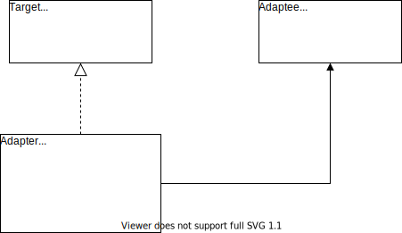

## Adapter Pattern Diagram

The adapter pattern converts an interface of a class into another interface the client expects. Adapter lets classes work together that otherwise couldn't because of incompatible interfaces.

