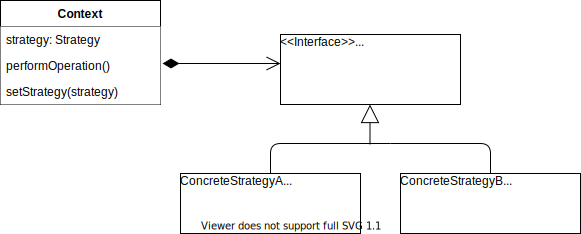

## Strategy Pattern Diagram

Strategy lets the implementation of an algorithm vary depending on a client that uses it. It does that by defining a family of algorithms and making them dynamically interchangeable. 

